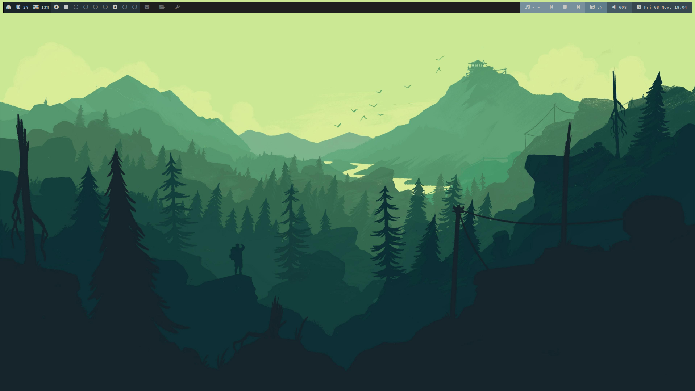
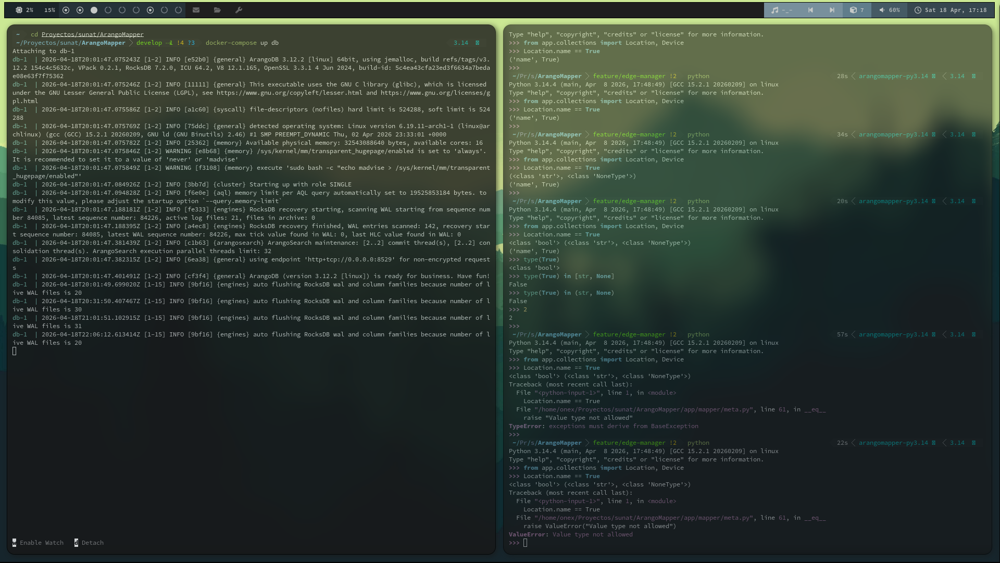
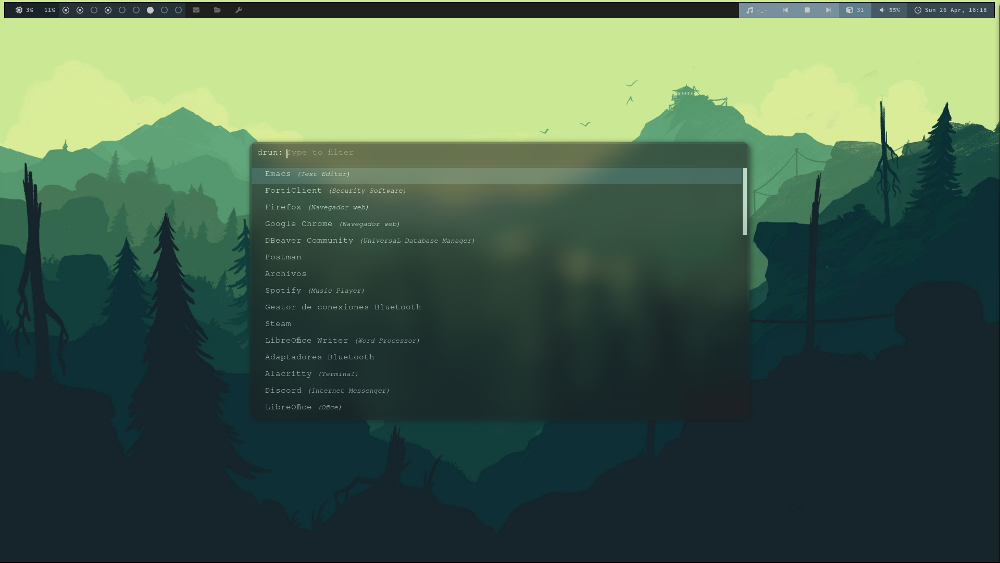

## Arch Linux Desktop Setup

[Read this in Spanish / Leer en Español](./README.es.md)

This repository contains my custom desktop environment configuration on Arch Linux, focused on performance, minimalism and productivity through a *tiling window manager* approach.

### Main components

| Component | Tool | Description |
| :--- | :--- | :--- |
| **WM** | [Awesome](https://awesomewm.org) | Tiling Window Manager (Lua) |
| **Terminal** | [Alacritty](https://alacritty.org) | GPU-accelerated emulator |
| **Panel** | [Polybar](https://github.com/polybar/polybar) | Modular status bar |
| **Launcher** | [Rofi](https://github.com/davatorium/rofi) | Application launcher and menus |
| **Compositor** | [Picom](https://github.com/yshui/picom) | Transparencies and soft effects |
| **Shell** | Zsh + P10k | Aesthetics and productivity on the console |

### Screenshots

#### Workflow and Terminal

*Alacritty view and mosaic window arrangement.*

#### Application launcher (Rofi)

### Features

- Minimalist and efficient configuration
- Keyboard-based workflow
- Clean aesthetic with transparencies and smooth effects
- Highly customizable environment
